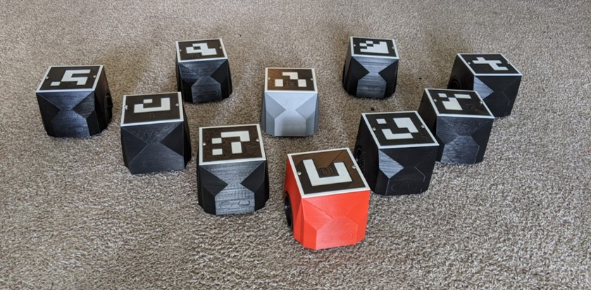

# Multi-Robot Testbed Platform

[](https://www.python.org/downloads/)
[](https://opensource.org/licenses/MIT)
[](https://github.com/yourusername/testbed)

> [🇪🇸 Versión en Español](#versión-en-español) | [🇬🇧 English Version](#english-version)

<p align="center">
  <!-- CAMBIA ESTO POR UN GIF DE TU PROYECTO FUNCIONANDO -->
  
</p>

---

## 🇬🇧 English Version

A comprehensive Python framework for simulating and deploying multi-robot control systems with real-time vision tracking using ArUco markers.

### 🎯 Features

- **🤖 Dual Operation Modes**: Seamless switching between Virtual Simulation and Real Hardware.
- **👁️ Vision-Based Tracking**: Real-time pose estimation using ArUco markers and OpenCV.
- **🛡️ Safety Mechanisms**: Barrier certificates for collision avoidance.
- **📈 Trajectory Tracking**: Load and follow predefined paths from MATLAB (`.mat`) data.

### 📸 Platform Showcase

| Robot Fleet | Real-World Experiment |
|:-----------:|:---------------------:|
| <!-- FOTO DEL GRUPO DE ROBOTS JUNTOS -->  | <!-- SCREENSHOT DE LA PRUEBA CORRIENDO -->  |
| *Differential drive robots equipped with ESP8266* | *Real-time vision tracking and control execution* |

### 📋 Table of Contents

- [Installation](#installation)
- [Quick Start](#quick-start)
- [Hardware Setup](#hardware-setup)
- [Project Structure](#project-structure)

---

## 🚀 Installation

### Prerequisites

- **Software**: Python 3.10+, pip, Git.
- **Hardware** (optional): USB Camera, ESP8266 modules, Mobile robots.

### Setup Steps

1. **Clone the repository**:
```bash
git clone https://github.com/niospinag/testbed.git
cd testbed
```

2. **Create a virtual environment**:
```bash
python3 -m venv venv
source venv/bin/activate  # Windows: venv\Scripts\activate
```

3. **Install package**:
```bash
pip install -r requirements.txt
pip install -e .
```

---

## 🎮 Quick Start

Run the basic simulation example:

```bash
python3 examples/basic_simulation.py
```

```python
# Code snippet example
from testbed import VirtualTestbed
from testbed.utils import io
import testbed.control.controllers as ctrl

# Load Data & Init
load_pos = io.load_data_matlab('data/trajectories/data_7v_7N.mat', split_data=10)
env = VirtualTestbed(number_of_robots=3, show_figure=True, initial_conditions=load_pos(0))

# Control Loop
while True:
    env.set_velocities(range(3), controller(env.get_poses(), goals))
    env.step()
```

---

## 🔧 Hardware Setup

To build the physical testbed, you need the following setup:

<p align="center">
  <!-- PON UNA FOTO DE TU SETUP COMPLETO (CAMARA + ARENA) AQUI -->
  
</p>

1.  **Camera**: Mounted overhead (check `config/camera/` for calibration).
2.  **Robots**: Differential drive robots equipped with **ESP8266** for WiFi/Serial communication.
3.  **Markers**: Print ArUco markers (`DICT_4X4_100`) from `assets/markers/`.

### Robot Detail
<p align="center">
  <!-- PON UNA FOTO PRIMER PLANO DE UN ROBOT AQUI -->
  
</p>

---

## 📝 Citation

If you use this platform, please cite:

```bibtex
@software{testbed2024,
  title={Multi-Robot Testbed Platform},
  author={Nestor Ivan Ospina},
  year={2024},
  url={https://github.com/niospinag/testbed}
}
```

---
---
---

# 🇪🇸 Versión en Español

## Plataforma Testbed Multi-Robot

Un framework completo en Python para simular y desplegar sistemas de control multi-robot, con seguimiento visual en tiempo real mediante marcadores ArUco.

### 🎯 Características Principales

- **🤖 Modos Duales**: Cambio transparente entre Simulación Virtual y Hardware Real.
- **👁️ Visión Artificial**: Estimación de pose en tiempo real usando ArUco y OpenCV.
- **🛡️ Seguridad**: Certificados de barrera (Barrier Certificates) para evitar colisiones.

## 📸 Galería del Sistema

| Flota de Robots | Prueba en Hardware Real |
|:---------------:|:-----------------------:|
| <!-- USA LA MISMA RUTA DE LA FOTO DEL GRUPO -->  | <!-- USA LA MISMA RUTA DEL SCREENSHOT -->  |
| *Robots diferenciales equipados con ESP8266* | *Seguimiento visual y control en tiempo real* |


### 📋 Contenido

- [Instalación](#instalación)
- [Inicio Rápido](#inicio-rápido)
- [Configuración de Hardware](#configuración-de-hardware)

---

## 🚀 Instalación

1. **Clonar repositorio**:
```bash
git clone https://github.com/tuusuario/testbed.git
cd testbed
```

2. **Instalar dependencias y el paquete**:
```bash
pip install -r requirements.txt
pip install -e .
```

---

## 🎮 Inicio Rápido

Para correr una simulación, usa el script en la carpeta `examples`.

```bash
python3 examples/basic_simulation.py
```

---

## 🔧 Configuración de Hardware

Para replicar el sistema físico necesitas:

<p align="center">
  <!-- USA LA MISMA FOTO DEL SETUP QUE ARRIBA -->
  
</p>

1.  **Cámara**: Montada cenitalmente (revisar `config/camera/` para calibración).
2.  **Robots**: Robots diferenciales equipados con **ESP8266**.
3.  **Marcadores**: Imprimir marcadores de `assets/markers/`.

---

## 📂 Estructura del Proyecto

El proyecto ha sido refactorizado para ser modular:

```text
Testbed/
├── assets/                 # Marcadores e Imágenes
├── config/                 # Calibración de cámara
├── data/                   # Trayectorias (.mat)
├── examples/               # Scripts ejecutables
├── testbed/                # PAQUETE PRINCIPAL
│   ├── config/             # Configuración global
│   ├── control/            # Controladores y Barreras
│   ├── core/               # Clases base
│   ├── hardware/           # Interfaz Real y Visión
│   ├── simulators/         # Simulador Virtual
│   └── utils/              # I/O y Geometría
└── setup.py
```

---

## 📧 Contacto

- **Autor**: Nestor Ivan Ospina Gaitan
- **Email**: niospinag@unal.edu.co
- **Issues**: Por favor reportar bugs en la pestaña de Issues.

---

<p align="center">
  Made with ❤️ for robotics research
</p>
